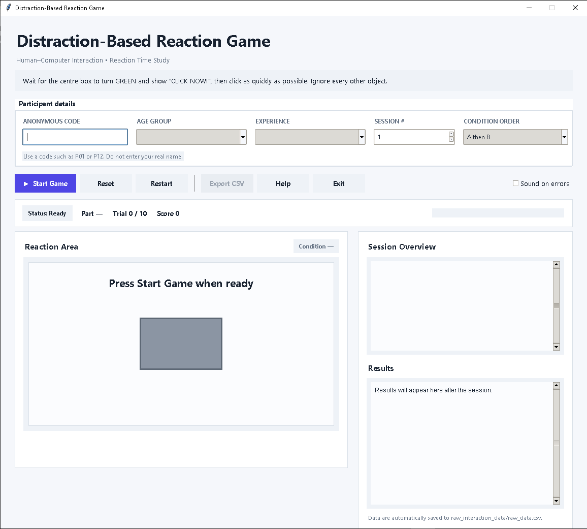

# Personal Expense Tracker

A desktop-based **Personal Expense Tracker** built with **Python and Tkinter**. The project provides a simple graphical interface for recording everyday expenses, organizing them by category, and monitoring the accumulated total.

## Screenshots

### Main Interface




## Overview

This application is designed around a straightforward expense-entry workflow:

1. Enter an expense description.
2. Enter a positive monetary amount.
3. Select an expense category.
4. Add the record to the expense table.
5. Review, delete, or clear records while the application is running.
6. Monitor the automatically updated total expense amount.

The original program is a single-window Tkinter application with in-memory expense storage, input validation, keyboard shortcuts, hover tooltips, status feedback, and a tabular record display.

## Main Features

- Add expense records with a description, amount, and category.
- Supported categories: **Food, Transport, Utilities, Entertainment, Health, Shopping, and Others**.
- Automatic total calculation in Philippine pesos (₱).
- Delete a selected expense.
- Clear all expense records.
- Clear the current input form without removing saved-in-session records.
- Input validation for required fields, numeric amounts, and positive values.
- `Enter` keyboard shortcut for adding an expense.
- `Delete` keyboard shortcut for removing the selected expense.
- Hover tooltips for key controls.
- Status messages for successful actions and validation errors.
- Record counter showing the number of expenses currently stored.
- Responsive-looking, organized table presentation using Tkinter's `Treeview`.

## User Interface

The interface was redesigned while preserving the program's original behavior. The updated layout uses:

- A prominent header area.
- A dedicated total-expenses display.
- A structured **Add Expense** card.
- A clean expense-record table.
- Separate action controls.
- A compact status-feedback area.
- Consistent spacing, typography, borders, and colors.

### Main Interface

Add the project screenshot to:

```text
assets/screenshots/MainInterface.PNG
```

Then this image will be displayed automatically in the repository README:


> **Note:** GitHub paths are case-sensitive. The filename in the README must exactly match the uploaded image filename.

## Project Structure

```text
PersonalExpenseTracker/
├── assets/
│   └── screenshots/
│       └── MainInterface.PNG
├── personal_expense_tracker.py
├── README.md
└── .gitignore
```

## Technologies Used

- **Python 3**
- **Tkinter** — graphical user interface
- **ttk** — themed Tkinter widgets
- **Standard Library only** — no third-party packages are required

## Requirements

Python 3.x with Tkinter support.

Tkinter is normally included with standard Python installations. On some Linux distributions, it may need to be installed separately through the operating system package manager.

## How to Run

Clone the repository:

```bash
git clone https://github.com/YOUR-USERNAME/Personal-Expense-Tracker.git
```

Move into the project directory:

```bash
cd Personal-Expense-Tracker
```

Run the application:

```bash
python personal_expense_tracker.py
```

On Windows, this may also be:

```bash
py personal_expense_tracker.py
```

## How to Use

### Add an Expense

Fill in all three fields:

- **Description** — short description of the purchase.
- **Amount** — a positive numeric value, such as `150.00`.
- **Category** — choose one of the available categories.

Click **Add Expense** or press `Enter`.

### Delete an Expense

Select a record in the table and click **Delete Selected**, or press `Delete`.

### Clear the Form

Click **Clear Form** to remove the current description, amount, and category from the input fields.

### Clear All Records

Click **Clear All Records** to remove every expense currently stored in the application.

## Validation Behavior

The program prevents invalid expense entries by checking:

- Required fields must not be empty.
- Amount must be numeric.
- Amount must be greater than zero.
- The **Add Expense** button remains disabled until all required fields contain values.

Validation and feedback messages appear in the status area at the bottom of the window.

## Data Handling

Expense records are kept in memory for the current application session.

Each expense is represented internally using a dictionary containing:

```python
{
    "desc": "Example expense",
    "category": "Food",
    "amount": 150.00
}
```

The current version does **not** include a database or permanent expense-file storage system. Closing the application therefore ends the current in-memory session.

## HCI Considerations

This project emphasizes basic human-computer interaction principles through:

- Clear grouping of related controls.
- Consistent visual hierarchy.
- Immediate status feedback.
- Error-prevention through input validation.
- Keyboard shortcuts for common actions.
- Hover tooltips for discoverability.
- Clear labeling of fields and actions.
- A table layout that separates descriptions, categories, and amounts.

The visual redesign changes presentation and styling while keeping the application's original functional behavior intact.

## Project Purpose

The project demonstrates how a simple desktop GUI can be organized around a user-centered workflow. It focuses on making routine expense entry quick, readable, and easy to understand while applying fundamental GUI and HCI concepts.

## License

This project can be distributed under the license selected by the repository owner.

If this repository is intended for an academic submission, follow your instructor or institution's requirements regarding reuse, attribution, and licensing.
